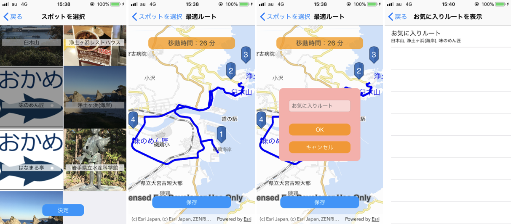
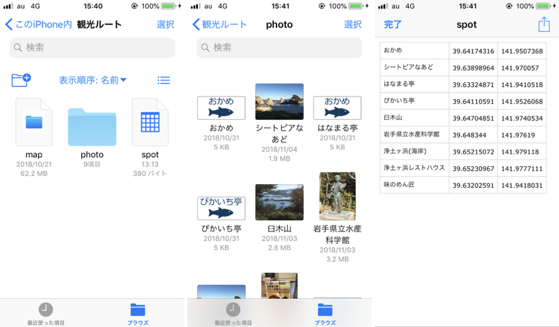

# find-route-ios
宮蘭航路フェリーハッカソン用に作成したオフラインで観光ルート検索を行う iOS アプリケーションです。写真から行ってみたい観光スポットを選択すると、最短時間で周れる最適ルートと移動時間を検索・表示します。検索したルートはお気に入りに登録して、後から確認することもできます。

## 機能
* マップの表示
* ルート検索（複数の地点を指定した最短ルートの検索）
* ルートのお気に入り登録

## 使用している製品
* [ArcGIS Pro](https://www.esrij.com/products/arcgis-pro)
* [ArcGIS Runtime SDK for iOS](https://www.esrij.com/products/arcgis-runtime-sdk-for-ios/) バージョン 100.4.0

ArcGIS の開発キットを使用して開発を行う場合は ArcGIS for Developers 開発者アカウント（[ArcGIS for Developers](https://developers.arcgis.com/)）が必要です。開発者アカウントは無償で作成することができます。作成方法は[こちら](http://esrijapan.github.io/arcgis-dev-resources/get-dev-account/)を参照してください。

## 動作環境
* iOS 12 / iOS 11

## データの準備
iTunes のファイル共有機能を使用して以下のファイルを観光ルート アプリに共有します。
* photo フォルダ
 * フォルダに観光スポットの写真を配置
* spot.csv（観光スポットの緯度経度）
 * 観光スポット名（写真のファイル名）, 緯度, 経度の順で格納
* map.mmpk([モバイル マップ パッケージ](http://pro.arcgis.com/ja/pro-app/help/sharing/overview/mobile-map-package.htm))
 * 背景地図用のマップとルート検索用のネットワーク データセットを含む

## ライセンス
Copyright 2018 Esri Japan Corporation.

Apache License Version 2.0（「本ライセンス」）に基づいてライセンスされます。あなたがこのファイルを使用するためには、本ライセンスに従わなければなりません。本ライセンスのコピーは下記の場所から入手できます。

> http://www.apache.org/licenses/LICENSE-2.0

適用される法律または書面での同意によって命じられない限り、本ライセンスに基づいて頒布されるソフトウェアは、明示黙示を問わず、いかなる保証も条件もなしに「現状のまま」頒布されます。本ライセンスでの権利と制限を規定した文言については、本ライセンスを参照してください。

ライセンスのコピーは本リポジトリの[ライセンス ファイル](./LICENSE)で利用可能です。
